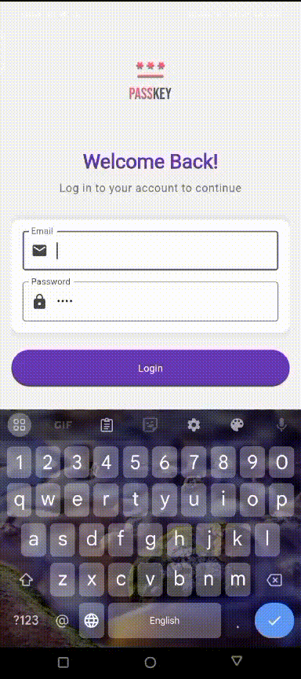
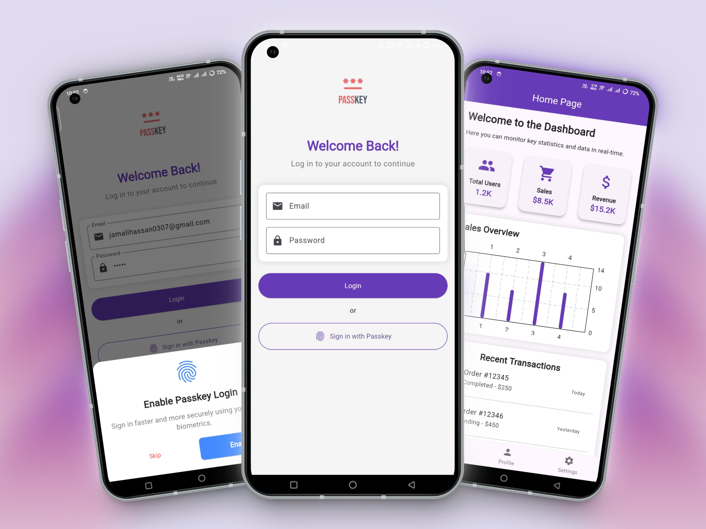
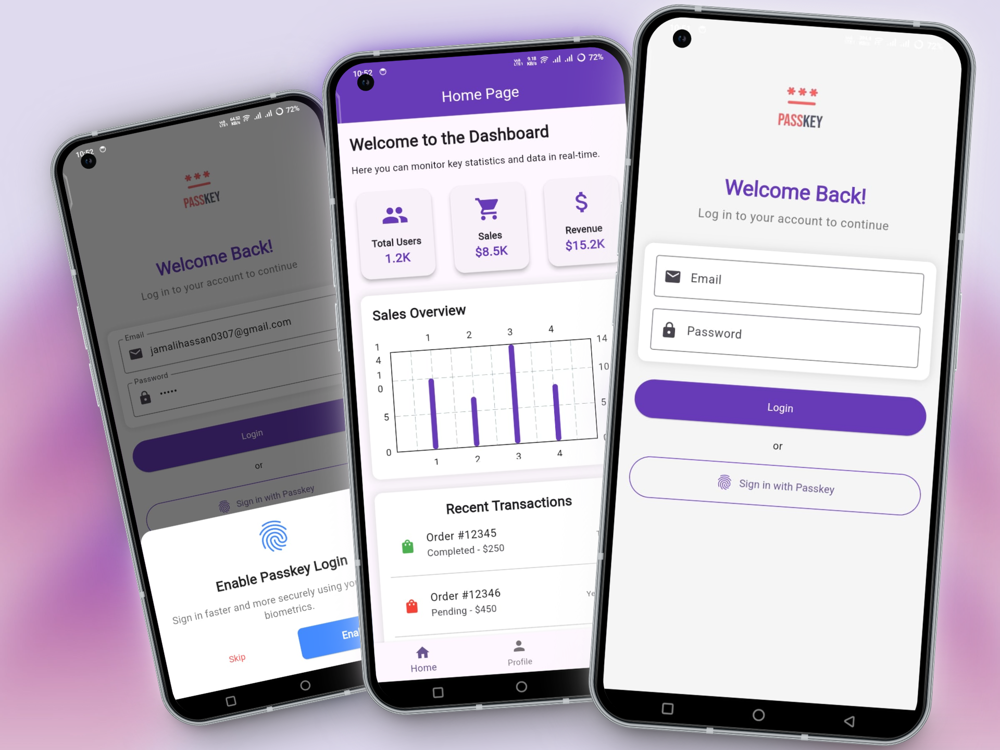
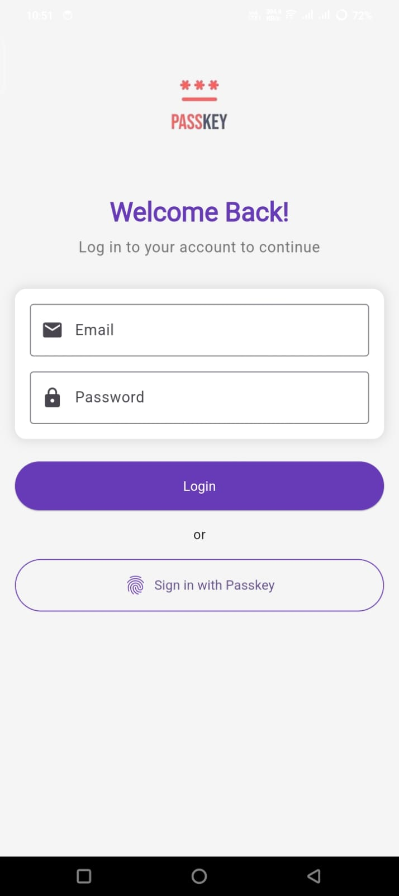
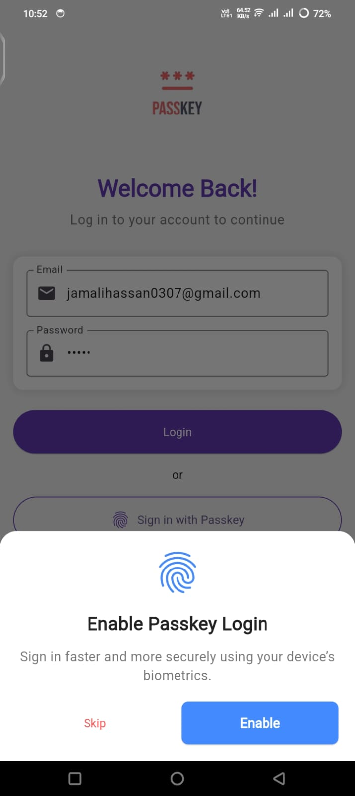
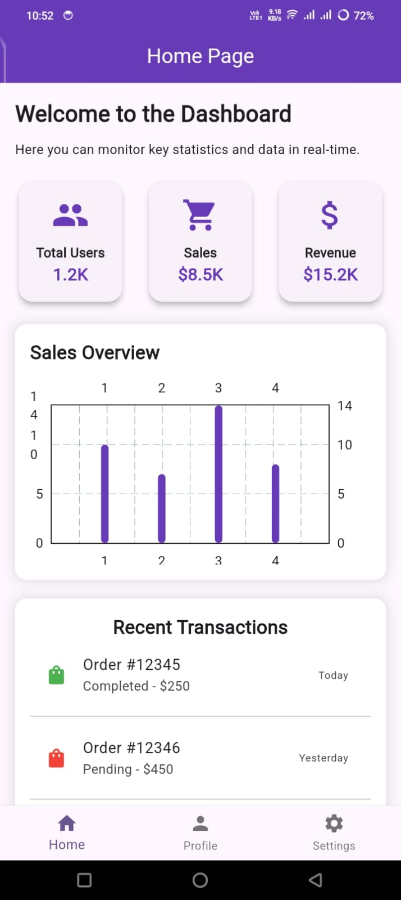
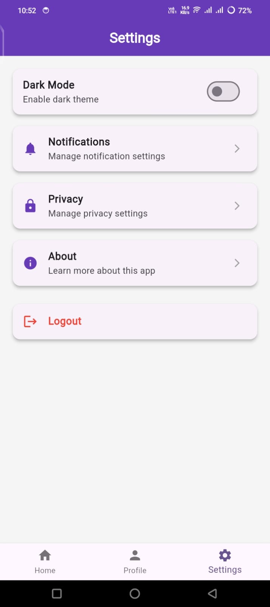

# 🔐 Flutter Passkey Authentication

A modern authentication solution using passkeys and biometrics in Flutter. This app demonstrates secure authentication without traditional passwords, featuring a beautiful dashboard and comprehensive user management.

## ✨ Features

- 📱 Modern Material Design UI with Purple Theme
- 🔒 Biometric Authentication
- 🔑 Passkey Support
- 💾 Secure Credential Storage
- 📊 Interactive Dashboard
- 👤 User Profile Management
- 🌓 Dark Mode Support
- 🔔 Push Notifications
- 🔐 Privacy Settings

## 📱 Demo

## 📸 Screenshots

### DEMO

    
    

### 📱 Mobile View App

    
    
    
    
    

## 📱 App Workflow

1. **Login Screen**

   - Traditional email/password login
   - Passkey authentication option
   - Biometric login support

2. **Dashboard**

   - Real-time statistics
   - Sales overview with interactive charts
   - Recent transactions monitoring
   - Quick access to key metrics

3. **Profile Management**

   - User information display
   - Profile picture management
   - Contact information
   - Account settings

4. **Settings**
   - Dark mode toggle
   - Notification preferences
   - Privacy settings
   - App information

## 🛠️ Technical Implementation

### Authentication Flow

1. **Traditional Login**

   - Email/password validation
   - Secure credential verification
   - Option to enable passkey

2. **Passkey Setup**

   - Biometric registration
   - Secure key generation
   - Device binding

3. **Biometric Authentication**
   - Fingerprint/Face recognition
   - Secure token management
   - Automatic login capability

### Dashboard Features

- Real-time data visualization
- Interactive charts using fl_chart
- Transaction monitoring
- User statistics tracking

## 🔒 Security Features

- Secure credential storage
- Biometric authentication
- Encrypted data transmission
- Session management
- Privacy-focused design

## 📞 Contact

Hassan Jamali - [@jamalihassan0307](https://github.com/jamalihassan0307)

Project Link: [https://github.com/jamalihassan0307/Flutter-passkeys-authentication](https://github.com/jamalihassan0307/Flutter-passkeys-authentication)

## 🙏 Acknowledgments

- Flutter Team
- Local Auth package contributors
- Flutter Secure Storage team
- FL Chart package for beautiful charts
- Material Design team for UI inspiration
